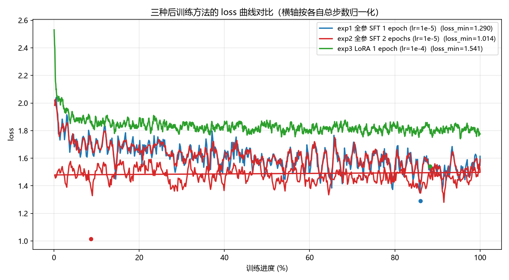
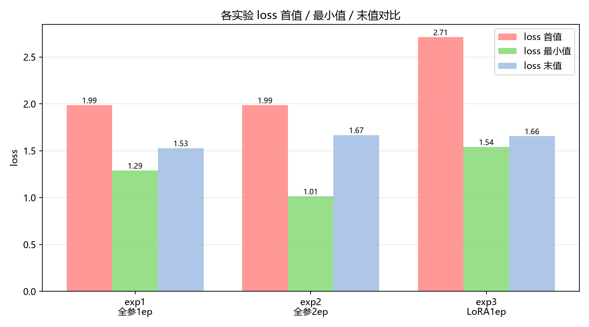
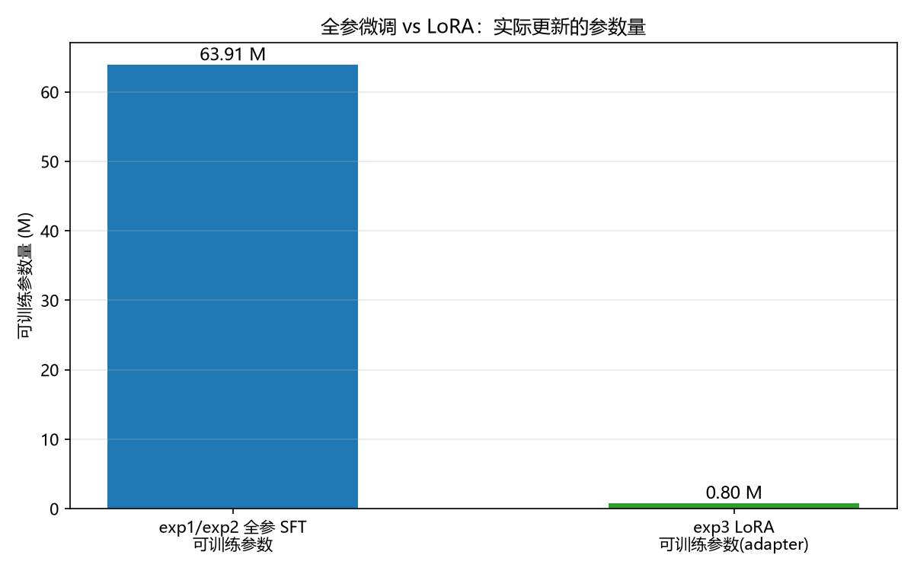
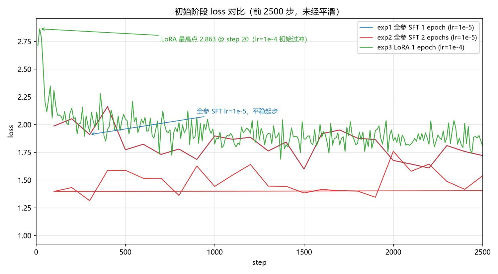

# MiniMind 后训练实验报告

> **实验日期**：2026-09-02
> **硬件**：AutoDL RTX 5090 (32GB) · torch 2.8.0+cu128 · Python 3.12 · transformers 4.57.6
> **项目**：jingyaogong/minimind（实验分支位于本 `experiments/` 目录，已同步 GitHub `Mr-luo-q/minimind`）

---

## 1. 实验对象：什么模型

本次所有实验基于 **MiniMind minimind-3（Dense）**，参数量 **63.91M（约 6400 万，≈0.064B）**：

| 配置项 | 值 |
|---|---|
| 隐藏维度 d_model | 768 |
| Transformer 层数 | 8 |
| 词表大小 | 6400 |
| Q heads / KV heads | 8 / 4（GQA） |
| max_position_embeddings | 32768（rope_theta=1e6） |
| 前馈层 | SwiGLU |
| **总参数量** | **63.91M**（fp16 权重约 128MB） |

**后训练的含义**：从官方预训练底座 `pretrain_768.pth` 出发，用指令数据继续训练，让模型学会"按指令格式回答问题"（SFT 阶段 label 只计算 `assistant` 回答部分，`user` 提问与模板 token 以 `-100` 屏蔽）。

---

## 2. 用了什么方法：三种后训练方案

| 实验 | 方法 | 脚本 | 数据 | 轮数 | batch | seq | lr | 可训练参数 |
|---|---|---|---|---|---|---|---|---|
| exp1 | **全参 SFT**（Full Fine-tuning） | `train_full_sft.py` | sft_t2t_mini（905,718 条对话） | 1 | 16 | 768 | 1e-5 | **63.91M（100%）** |
| exp2 | **全参 SFT** | `train_full_sft.py` | 同上 | **2** | 16 | 768 | 1e-5 | 63.91M（100%） |
| exp3 | **LoRA**（低秩适配） | `train_lora.py` | 同上 | 1 | 32 | 768 | 1e-4 | **~0.797M（约 1.2% adapter）** |

- exp1 / exp2 对比 → 考察**训练轮数（数据利用次数）**对 SFT 效果的影响；
- exp1 / exp3 对比 → 考察**全参更新 vs 参数高效微调（LoRA）**在同等数据、同起点下的差异；
- 三者共享同一起点 `pretrain_768.pth`、同一数据、同一评测集（8 个固定问题），除上述变量外其余配置一致。

---

## 3. 跑了几次实验

**3 次训练实验 + 4 组模型评测**（同一 8 问对 4 个模型依次提问）：

| # | 模型 | 来源 | 评测输出 |
|---|---|---|---|
| 1 | pretrain（SFT 前底座） | 官方权重 | `results/mini_sft/exp1_ep1/probe_before_pretrain.txt` |
| 2 | exp1：全参 SFT 1 epoch | 本次训练产物 | `results/mini_sft/exp1_ep1/probe_after_sft.txt` |
| 3 | exp2：全参 SFT 2 epochs | 本次训练产物 | `results/mini_sft/exp2_ep2/probe_after_sft_ep2.txt` |
| 4 | exp3：LoRA 1 epoch | 本次训练产物（adapter 叠加在 pretrain 上） | `results/mini_sft/exp3_lora_ep1/probe_lora.txt` |

每轮训练均记录了完整日志（`train.log`，全参 SFT 每 100 步一条、LoRA 每 10 步一条）与 loss 序列（`loss_curve.csv`）。

---

## 4. 实验结果可视化

### 4.1 三种方法的 loss 曲线对比

横轴按各实验自身总步数归一化为训练进度百分比；曲线做了轻量平滑便于观察趋势（蓝=全参 1ep，红=全参 2ep，绿=LoRA 1ep，圆点标记各自 loss 最低点）：



**读图要点**：
- exp1（蓝）与 exp2（红）前 50% 阶段几乎重合——同一数据第一轮学习行为一致；exp2 在第二个 epoch（50%~100%）继续下降，loss 最低点 **1.014** 明显低于 exp1 的 1.29；
- exp3（绿）从 pretrain 出发、以更高 lr（1e-4）训练，初期波动更大（见 4.4 放大图），最终收敛到接近 exp1 的水平；
- 三个实验末尾的 loss 末值都有回升/波动——这是 lr 余弦衰减到底 + 采样间隔的叠加现象，不代表模型变差（评估应以 loss 最低点附近的 checkpoint 为准）。

### 4.2 loss 首值 / 最小值 / 末值对比



| 实验 | loss 首值* | loss 最小值 | loss 末值 |
|---|---|---|---|
| exp1 全参 1ep | 1.987 | **1.29** | 1.529 |
| exp2 全参 2ep | 1.987 | **1.014** | 1.668 |
| exp3 LoRA 1ep | 2.712 | 1.541 | 1.656 |

> *首值 = 日志首个打点，注意打点间隔不同：exp1/exp2 首个打点在 step 100，exp3 在 step 10（详见第 7 节"为什么 LoRA 初始 loss 更大"）。

### 4.3 实际更新的参数量：全参 vs LoRA



LoRA 只训练 **0.797M** 参数（adapter 权重文件仅 797KB），约为全参微调的 **1/80**，却能在 1 epoch 内把 loss 压到 1.54——这就是参数高效微调"小参数、大效果"的直观体现（代价是容量上限低于全参，见 4.2 中 exp1 最小值更低）。

### 4.4 初始阶段放大：为什么 LoRA 的首个记录 loss 更高



exp3（LoRA，lr=1e-4）在 step 20 冲到最高 **2.86** 后迅速回落；exp1（全参，lr=1e-5）全程平稳在 ~2.0。原因分析见第 7 节。

---

## 5. 定性对比小结

对同一 8 问，SFT 前后的回答差异主要体现在**格式纪律**（编号列表、加粗标题、礼貌收尾），而不是知识量本身（64M 模型 + 1 epoch 的知识提升有限，回答仍常有事实错误与车轱辘话——这正是后续 RL 阶段想改善的方向）。全部回答原文见第 6 节。

**示例 Q1「你有什么特长？」（SFT 前 vs SFT 后，节选）：**

SFT 前（pretrain 底座，直接续写）：
> 作为AI助手，我没有个人特长或特长。我被设计为根据提供的信息和指令执行任务……然而，我没有个人特长或能力，因为我没有自我意识或情感。

SFT 后（exp1，全参 SFT 1 epoch）：
> 作为AI助手，我的主要职责是提供准确、高效的信息和帮助。我的特长包括但不限于：
> 1. **知识丰富**：能够从不同领域的知识和信息中找到解答……
> ……
> 我的特长是快速响应、知识、多语言……如果您有任何问题或需要帮助，随时告诉我，我会尽力提供帮助。

---

## 6. 全部 probe 回答全文（8 问 × 4 模型，逐字原文）

> 说明：为保持逐字原文（回答中本身包含 markdown 加粗、列表与 ```python 代码块），以下回答以 HTML `<pre>` 原样块呈现。评测设定：固定每问 seed（1000+i）、top_p=0.95、temperature=0.85、max_new_tokens=512（脚本 `_tools/eval_probe.py`，部署于实例 `/root/autodl-tmp/eval_probe.py`）。

### 模型：SFT 前底座（pretrain_768.pth，无指令模板，直接续写）

来源文件：`experiments/results/mini_sft/exp1_ep1/probe_before_pretrain.txt`


**Q1: 你有什么特长？
A1: 作为AI助手，我没有个人特长或特长。我被设计为根据提供的信息和指令执行任务，回答问题和提供建议。我的“特长”取决于我被设计用来提供信息、解答问题或执行任务。我的“特长”是基于预先编程的算法和数据结构。它允许我以简洁的方式呈现信息，提供解决问题的建议。然而，我没有个人特长或能力，因为我没有自我意识或情感。**


**Q2: 为什么天空是蓝色的
A2: ？天空之所以呈现出蓝色，是因为大气散射。当太阳光线穿过大气层时，大气中的气体分子会遇到分子中的短波长光，这种短波长的紫光会被散射到各个方向，使得我们能够看到地面的蓝色。空气分子对蓝色光的散射是因为光线在穿过大气层时，被散射的程度较小，而散射的程度较大，光线被散射的程度较大，蓝色光波就会穿透大气层，所以天空看起来就呈现出蓝色。同时，在白天，太阳光线经过的路面与大气层中的气体分子相互作用时，蓝色光波会被散射，而红色光波则会被散射。但是，由于空气分子较多，光线散射的程度较小，所以在一定程度上，天空会呈现出橙色和红色的色调。**


**Q3: 请用Python写一个计算斐波那契数列的函数
A3: 。fibonacci(10) 的函数可以用以下方式编写：```pythondef fibonacci(n):if n <= 0:return 0elif n == 1:return 1else:return fibonacci(n-1) + fibonacci(n-2)```这里使用了递归函数来进行计算。如果n为0或1，则返回0，否则返回n-1和n-2的和。如果n为1或2，则递归调用函数来计算前面两个数的和，将结果存储在变量fibonacci(10)中。**


**Q4: 解释一下"光合作用"的基本过程
A4: 和应用。光合作用是指植物、藻类、一些细菌等生物利用光能将二氧化碳和水转化为有机物质和氧气的过程。这个过程发生在植物的叶子中，该过程包括三个主要阶段：光反应、暗反应和葡萄糖反应。光反应是光合作用的关键步骤，它通过将二氧化碳和水转化为葡萄糖和氧气的过程。光反应在植物中发生，需要一个叶绿素分子来吸引光子。在暗反应中，光能被激发到一个高能态，即光能被转化为电子的势能。当光子被激发到光合子时，会发生激发电子跃迁，转化为高能态的分子，即ATP和NADPH。葡萄糖反应是光合作用的关键步骤之一，它可以发生在植物的叶子中，是植物生长和发育的重要过程之一。光合作用的应用广泛，包括以下几个方面：1. 能源储存：光合作用是利用光能将二氧化碳和水转化为有机物质的关键步骤。光合作用可以利用太阳能将二氧化碳和水转化为葡萄糖和氧气。2. 生物化学反应：光合作用还涉及到一些生物化学反应，如暗反应和葡萄糖反应。光合作用可以通过利用光能将水分解成有机物质和氧气。3. 生物化学反应：光合作用还涉及到许多生物化学反应，如酶的催化**


**Q5: 如果明天下雨，我应该如何出门
A5: ？如果您明天下雨，建议您出门前检查天气预报，以确保天气状况良好。此外，您还可以注意保持健康的饮食和水分摄入，并避免在雨天行走，以免在雨天出行造成不便。最后，建议您随时关注天气预报，以便提前做好准备并保持安全。**


**Q6: 比较一下猫和狗作为宠物的优缺点
A6: 。猫和狗都是被人类当做宠物的常见选择。以下是几个猫和狗的优缺点：优点：1. 温顺：猫比较独立，不需要太多的关注，喜欢睡觉。2. 性情：猫比较独立，不需要太多的关注，但也比较容易训练，喜欢追逐小动物。3. 运动爱好：猫喜欢活动，尤其是室内猫，有助于它们保持身体健康。4. 独立性：猫比较独立，不需要太多的关注和照顾，但是需要一定的训练和社交化。狗优点：1. 忠诚：狗的忠诚度很高，对主人忠诚，不会给人带来太多麻烦。2. 灵敏：狗具有极高的听力、嗅觉和触觉能力，能够帮助它们识别食物、打猎、打乱家具等。3. 活泼：狗比较活泼，需要大量的运动和刺激，但也需要足够的关注和照顾。4. 安静：狗比较安静，不需要太多的关注和照顾，但也不需要太多的关注和照顾，对主人充满爱。狗的缺点：1. 运动：狗的训练需要花费时间和精力，但也需要运动和社交互动，但是也需要足够的关注和照顾，不能过度追求外表。2. 社交：狗需要足够的社交和互动，但是也需要足够的社交和互动**


**Q7: 解释什么是机器学习
A7: ，并给出一个实际的例子。机器学习是一种人工智能的应用领域，它允许计算机自动地从数据中学习和改进。它通过使用统计分析和算法来分析和识别数据中的模式和关系，从而使计算机可以自动地做出预测和决策。例如，我们可以使用机器学习算法来训练一个神经网络来预测房价。这个网络可以学习大量的数据并将其与当前的输入进行比较，以确定其预测的准确性。同样，我们也可以使用机器学习算法来预测市场趋势。预测市场趋势的过程是通过对历史数据进行分析和学习，从而识别市场中的模式和趋势，并预测未来销售或客户需求的变化。机器学习有很多不同的类型，每种类型都具有不同的应用场景。举个例子，我们可以将机器学习算法应用在电子商务平台，通过对客户行为进行分析和预测，从而实现更准确的销售预测。举个例子，我们可以使用机器学习算法来预测客户的购买行为，如电子邮件营销、社交媒体营销等。通过对客户的行为进行分析和预测，我们可以了解客户的需求，从而提供更个性化的产品和服务，提高客户满意度。**


**Q8: 推荐一些中国的美食
A8: ，并在输入字段中提供一些中国菜的名字和它们的简介。我推荐的中国菜是糖醋排骨。以下是几个具有代表性的美食，它们是：1. 水煮鱼：来自四川的特色菜肴，口味鲜美，是中国菜中的代表性菜肴之一。2. 麻婆豆腐：以豆腐为主要原料，加入肉末、豆瓣酱、花椒、辣椒等调料，加入酱油、盐、味精、香油等调料，烹饪出来的麻辣口味，深受食客喜爱。3. 宫保鸡丁：由鸡丁、花生、葱、姜、蒜等配料组成的传统川菜，口味清淡，适合喜欢辣味的人尝试。4. 鱼香肉丝：来自四川的特色菜肴，口味辣适口，是川菜的代表性菜肴之一。5. 红烧肉：来自上海的传统美食，口感鲜嫩，肉质鲜美，是四川人最喜爱的食品之一。**

### 模型：exp1：全参 SFT 1 epoch 后

来源文件：`experiments/results/mini_sft/exp1_ep1/probe_after_sft.txt`


**Q1: 你有什么特长？
A1: 作为AI助手，我的主要职责是提供准确、高效的信息和帮助。我的特长包括但不限于：**

<pre>1. **知识丰富**：能够从不同领域的知识和信息中找到解答，帮助用户在学习、工作和生活中获得新知识。
2. **个性化**：根据用户的需求和偏好提供定制化的服务，提升用户体验。
3. **语言支持**：能够与全球各地的语言交流，提供准确、及时的语言翻译。
4. **问题解答**：高效地解答用户的问题，提供准确的答案，无论是学术、技术还是日常问题。
5. **学习与应用**：根据用户的学习习惯和需求，提供个性化的学习路径和资源。
6. **娱乐与休闲**：提供娱乐内容，如歌曲、笑话、书籍等，帮助用户放松身心。
7. **日常用语**：回答问题，提供简单明了的语言解释，帮助用户更好地理解和使用。
8. **安全性**：提供加密通信服务，保护用户数据和隐私。
9. **安全与合规**：遵守相关法律法规，确保用户数据的安全和合规。
10. **语言翻译**：帮助用户将源语言翻译成中文，促进国际交流和知识共享。</pre>

<pre>我的特长是快速响应、知识、多语言，能够根据不同用户的需求和偏好提供个性化的服务。如果您有任何问题或需要帮助，随时告诉我，我会尽力提供帮助。</pre>


**Q2: 为什么天空是蓝色的
A2: 天空是蓝色的原因有很多，以下是一些主要的解释：**

<pre>1. **光线的散射**：当太阳光从地面射向地球时，光线会以不同的速度散射，包括红、橙、黄、绿、蓝、靛、紫等，这些颜色的强度会随着太阳的位置而变化。当这些光线从天空中向中等速度散射时，它们会以不同的速度散射，而分散的能量会被散射到不同的方向。</pre>

<pre>2. **大气散射**：地球的大气层中的气体和微小颗粒如氮、氧、水蒸气等含量大气分子的散射作用。这些散射的微小颗粒，使得蓝光的波长较短，因此在我们看到的时候，蓝光的散射更为明显，尤其是当光线进入大气层时，蓝光会更散射到我们的眼睛中，而红光则会更多地散射到我们的眼睛中，所以天空看起来是蓝色的。</pre>

<pre>3. **大气散射**：天空中的不同颜色被散射，包括红、橙、黄、绿、蓝、靛、紫等。这些颜色在我们看到的时候是由大气中的空气分子、水蒸气、尘埃等分子间的相互作用而产生的。当这些分子在天空中或遥远的天空中移动时，它们会以不同的速度散射。</pre>

<pre>4. **人类观察**：人类通过观察天空中的物体和场景，如日出日落、星星、流星雨等，来观察天空的颜色。这些观察会帮助我们理解天空的视觉效果，以及天空为什么呈现出蓝色。</pre>

<pre>综上所述，天空是蓝色的，是因为光线在穿过地球大气层时，被散射，以及散射作用，使得天空呈现出蓝色。</pre>


**Q3: 请用Python写一个计算斐波那契数列的函数
A3: 当然可以！下面是一个简单的Python代码函数，用于计算斐波那契数列的第n项：**

<pre>```python
def fibonacci(n):
    fib_sequence = [0, 1]
    while len(fib_sequence) &lt; n:
        fib_sequence.append(fib_sequence[-1] + fib_sequence[-2])
    return fib_sequence</pre>

<pre># 示例：计算斐波那契数列的第10项
fib_sequence = fibonacci(10)
print(&quot;斐波那契数列的第10项是:&quot;, fib_sequence)
```</pre>

<pre>这段代码首先定义了一个名为`fibonacci`的函数，它接受一个参数`n`，表示要计算的斐波那契数列的项数。函数内部，我们首先创建了一个包含斐波那契数列前两个元素的列表`fib_sequence`。然后，我们使用一个`while`循环来生成斐波那契数列，其中`len(fib_sequence)`计算了当前项的位置，并将当前项添加到列表的长度中。最后，函数返回斐波那契数列的第10项。</pre>

<pre>在示例中，我们调用了`fibonacci`函数并将结果存储在变量`fib_sequence`中，并调用了`fibonacci`函数来计算斐波那契数列的第10项。最后，我们打印出计算得到的斐波那契数列的前10项。</pre>


**Q4: 解释一下"光合作用"的基本过程
A4: "光合作用"是一个广泛的概念，指的是从太阳光的吸收、分散和释放过程中的光能转化为有机物质的过程。光合作用主要发生在植物的叶子中，通常在叶绿体中进行。这个过程主要发生在光反应（DNA聚合酶）的合成中，当CRISPR反应生成CRISPR-Cas9的二氧化碳（CO2）和水（H2O）时，CRISPR-Cas9被激活。**

<pre>### 光合作用的基本过程</pre>

<pre>1. **光反应**：光能被吸收并转化为ATP（光能+电子能）和NADPH（还原色）等光能，这些过程在叶绿体的膜上以光的形式产生ATP，供细胞使用。
2. **糖类分解**：光能被分解成CO2分子。CO2分子被水分子分解为葡萄糖和氧气，这个过程通过多种途径进入细胞内，如细胞膜，参与细胞内外的营养循环和能量转换。
3. **电子传递链**：光能被细胞内的电子传递链（如NADPH、NOx等）传递，在光反应中，这些过程可以转化为ATP和NADPH。
4. **RNA聚合酶的作用**：RNA聚合酶的作用是将NADPH转化为NADPH。这个过程包括以下步骤：</pre>

<pre>- **光反应**：RNA聚合酶被进一步分解，将NADPH转化为NADPH。这一过程通常在ATP的上部和下部进行。
- **RNA聚合酶的作用**：RNA聚合酶能够将ATP中的RNA聚合酶分解为两个或三个环状分子。这些环状分子在光能转化过程中会分解出ATP。
- **能量转移**：RNA聚合酶的作用是将NADPH转化为ATP。这个过程利用了RNA聚合酶的效率，使得NADPH的效率和能量密度大幅提升。</pre>

<pre>### 总结</pre>

<pre>光合作用是光合作用的主要形式，它涉及光能的转移、光化学元素的合成</pre>


**Q5: 如果明天下雨，我应该如何出门
A5: 如果明天下雨，出门时应该注意天气状况和携带轻便的雨具。以下是一些建议：**

<pre>1. **注意天气状况**：尽量避免在下雨时携带雨具，尤其是雨水，因为雨水可能污染大气。</pre>

<pre>2. **携带雨具**：带上防水外套、雨靴或雨衣，以应对突然降雨的情况。</pre>

<pre>3. **携带雨具**：如果遇到积水，携带雨伞或雨衣，以备不时之需。</pre>

<pre>4. **携带雨具**：如果天气较为恶劣，携带雨伞或雨衣。确保携带干净的衣物，以防止突然下雨时产生的尘埃。</pre>

<pre>5. **保持干燥**：即使在雨季，天气变化也很快，保持干燥有助于减少雨水，让下雨自然停止。</pre>

<pre>6. **携带雨具**：如果天气情况允许，携带雨具可以大大减少下雨的可能性。</pre>

<pre>7. **携带防水背包**：携带一些防水背包，如防水背包，以备不时之需。</pre>

<pre>8. **准备应急包**：如果可能，准备一个应急包，如手电筒、雨衣等，以应对可能的暴雨。</pre>

<pre>9. **检查是否有雨伞或雨衣**：如果天气允许，尽量穿上雨靴，如果无法应对，就要带伞或雨衣。</pre>

<pre>10. **保持干燥**：即使在下雨的天气中，也要注意保持室内干燥，避免湿气导致感冒。</pre>

<pre>记得，天气状况变化可能会随时间而改变，因此出门时记得带伞或雨衣是个好主意。如果天气允许，携带一把雨伞或雨衣可以更方便地应对可能的暴雨。</pre>


**Q6: 比较一下猫和狗作为宠物的优缺点
A6: 猫和狗都是宠物的常见选择，但它们在许多方面都具有显著的优点。以下是两者的各自的优缺点：**

<pre>### 猫
- **优点**：猫通常比狗更独立，但它们不需要像狗那样频繁的互动，因为它们有自己的空间和偏好。猫对主人有很强的依赖性，他们不需要像狗那样频繁的互动，因为它们不需要经常的物品。
- **缺点**：猫的行为相对较为简单，猫更喜欢独处，因为它们不需要像狗那样频繁的互动。猫则更喜欢独处，因为它们不需要像狗那样频繁地互动。猫的行为通常较为轻松，不需要像狗那样频繁的互动。</pre>

<pre>### 狗
- **优点**：狗是社交动物，忠诚，需要大量的关注。它们不需要像狗那样频繁的互动，因为它们不需要像狗那样频繁的互动。狗喜欢独立行动，不需要像狗那样频繁的互动。
- **缺点**：狗对主人有很强的依赖，需要频繁的自我照顾。它们需要在适当的时间和环境下得到照顾，如遛狗、护理等。</pre>

<pre>### 相比之下
- **优点**：狗通常不需要像狗那样频繁的互动，因为它们不需要像狗那样频繁的互动。它们不需要像狗那样频繁的互动，因为它们不需要像狗那样频繁的互动。
- **缺点**：狗需要与主人互动，这在一定程度上限制了它们独立的生活能力。相比之下，狗可能对主人的需求较低，需要更多的空间和时间来满足。</pre>

<pre>### 总结
- **猫**：和狗在宠物的优点有：独立、不需要像狗那样频繁的互动、需要频繁的自我照顾、需要独立的生活和空间。
- **狗**：与狗相比，与狗相比，狗有更复杂的社交方式、不需要像狗那样频繁的互动、需要更多的空间和时间来满足需求。</pre>

<pre>选择猫还是狗。根据宠物的不同需求，狗和狗各有特点和优点。选择一只适合您生活的宠物，有助于您</pre>


**Q7: 解释什么是机器学习
A7: 机器学习是人工智能（AI）的一个子领域，它研究如何让计算机从数据中学习并自主地完成任务，而无需明确编程。机器学习通过构建模型，让计算机能够自动地从数据中学习，而无需人工干预。它使用算法和统计模型来指导和预测。**

<pre>机器学习是通过训练数据集来构建模型的过程，这些模型能够自动地发现数据中的规律，并根据这些规律进行预测或决策。机器学习的应用非常广泛，包括但不限于语音识别、图像识别、自然语言处理、推荐系统、医疗诊断、金融分析、推荐系统、自动驾驶、智能客服等。</pre>

<pre>机器学习的算法和方法主要有以下几种：</pre>

<pre>1. **监督学习**：是机器学习的常见方式，它通过学习输入数据的特征和输出，以预测新数据的输出。常见的监督学习算法包括线性回归、逻辑回归、支持向量机、决策树、随机森林、梯度提升树等。</pre>

<pre>2. **无监督学习**：是机器学习的一种，它利用没有标签或标签的数据集，从中自动发现数据中的结构和模式。常见的无监督学习算法包括聚类、降维、关联规则学习、降维等。</pre>

<pre>3. **半监督学习**：是机器在处理大量数据时，不需要完全标记或标签的数据。这种方法不需要标记或标签，而是通过少量的标记数据进行训练，然后在新数据上学习到一个或多个子集。</pre>

<pre>4. **强化学习**：是一种机器学习的子领域，通过与环境交互，实现从反馈到决策的智能体，然后通过与环境的交互来学习如何做出最优决策。强化学习常见的应用包括游戏、机器人控制、自然语言处理等。</pre>

<pre>5. **深度学习**：是一种机器学习的分支，它通过多层神经网络模型学习数据的复杂特征和模式，从而实现更高级别的预测和决策。深度学习在图像识别、自然语言处理、语音识别等领域有广泛应用。</pre>

<pre>机器学习是通过算法和模型，从数据中自动发现数据中的规律，并基于这些规律进行决策，从而实现自动化和智能化。</pre>


**Q8: 推荐一些中国的美食
A8: 中国菜系非常丰富，涵盖了各种传统菜系，让人们能够享受到不同风味的美食。以下是一些著名的美食推荐：**

<pre>1. **川菜**：四川菜以其麻辣鲜香著称，是世界美食的代表。川菜的麻辣鲜香，是“麻辣香锅”的代表，也是麻辣鲜香的代表。</pre>

<pre>2. **粤菜**：广东早茶，以煎饼、藜麦、泡菜、泡菜等为代表，清淡爽口，是广东地区的特色美食。</pre>

<pre>3. **烧鹅**：烧鹅是中国北方的特色美食，以其鲜美的鹅肉和麻辣鲜香著称。</pre>

<pre>4. **叉烧**：叉烧是一种源自四川的叉烧，以猪肉为主料，肉质嫩滑，口感丰富。</pre>

<pre>5. **湘菜**：湘菜以其辣香味和酸甜口感著称，是湖南菜的代表之一。</pre>

<pre>6. **浙江菜**：浙江菜以浙江的自然风光著称，口感清爽，味道独特。</pre>

<pre>7. **福建菜**：福建菜以福建菜为主，如糟炒、炸、烧汤等，味道浓郁，是广东地区的代表菜。</pre>

<pre>8. **清蒸鲈鱼**：鲈鱼是传统的鱼类，以新鲜的鱼肉为主料，搭配特制的调料，鲜香可口。</pre>

<pre>9. **豆瓣炒肉**：豆瓣炒肉是川菜中的经典之一，以猪肉为主料，烹饪时掌握肉质，以豆腐为主料，汤汁浓郁。</pre>

<pre>10. **干锅羊肉**：干锅猪肉是一道融合了川菜和粤菜的烹饪方式，汤汁鲜美，汤汁浓郁。</pre>

<pre>这些美食不仅在中国享有盛誉，也深受全球美食爱好者的喜爱。</pre>

### 模型：exp2：全参 SFT 2 epochs 后

来源文件：`experiments/results/mini_sft/exp2_ep2/probe_after_sft_ep2.txt`


**Q1: 你有什么特长？
A1: 作为AI助手，我的主要功能是协助用户解答问题、提供信息、进行娱乐互动等。我具有强大的学习和适应能力，能够根据用户的需求提供相应的帮助。我的能力包括：**

<pre>1. **多语言支持**：我可以多语言，支持汉字、英文、日语、西班牙语、法语、德语、意大利语等多种语言，覆盖广泛的场合。</pre>

<pre>2. **知识库**：我能够从用户提供的所有信息中获取知识，包括但不限于历史、科学、艺术、文化、历史、科学等领域的知识。</pre>

<pre>3. **个性化服务**：根据用户的使用习惯和偏好，提供定制化的服务，如推荐、购物、查询服务等。</pre>

<pre>4. **情感支持**：能够帮助用户表达情感，提供安慰、建议或娱乐，促进人际关系的建立。</pre>

<pre>5. **多语言支持**：我可以支持多种语言的交流，包括中文、英文、日语、西班牙语等，满足不同语言和文化背景的用户需求。</pre>

<pre>6. **持续学习**：我是一个持续学习的AI，通过不断更新知识库和算法，不断提升自己的能力。</pre>

<pre>我非常注重用户的需求和体验，能够提供更加贴心、高效、个性化的服务。如果有任何具体需求，欢迎随时向我咨询，我会尽力提供帮助。</pre>


**Q2: 为什么天空是蓝色的
A2: 天空是蓝色的，因为空气中的气体（称为蓝色气体）会散射太阳光中的短波蓝色光，而蓝色光由各种大气分子（如氧气、氮气等）组成，这些分子能将太阳光中的蓝色光散射到各个方向。因此，当太阳光进入地球大气层时，蓝色光被散射到各个方向，使得我们能看到的天空呈现出蓝色。**

<pre>然而，这只是一个间接的解释，实际上天空之所以呈现出蓝色，是因为空气中的气体分子的散射比其他气体分子更频繁地散射阳光，使得这些光线散射得更少，更容易到达我们的眼睛。而空气中的气体分子散射较少，这使得天空看起来更蓝。此外，大气中的气体分子对红色光的散射程度也较低，因此它们更容易向太阳辐射出更多的气体，导致天空呈现出蓝色。</pre>

<pre>总结来说，天空之所以呈现出蓝色，是因为空气中的气体分子散射了太阳光中的短波蓝色光，而这些短波蓝色光只在短波蓝色光的不同区域被散射，从而使得天空呈现出红色。</pre>


**Q3: 请用Python写一个计算斐波那契数列的函数
A3: 当然可以！下面是一个简单的Python代码函数，用于计算斐波那契数列的第n项：**

<pre>```python
def fibonacci(n):
    fib_sequence = [0, 1]
    while len(fib_sequence) &lt; n:
        fib_sequence.append(fib_sequence[-1] + fib_sequence[-2])
    return fib_sequence</pre>

<pre># 示例：计算斐波那契数列的第10项
n = 10
print(f&quot;斐波那契数列的第{n}项是: {fibonacci(n)}&quot;)
```</pre>

<pre>这个函数首先定义了一个名为`fibonacci`的函数，它接受一个参数`n`。函数内部，我们首先创建了一个列表`fib_sequence`，然后使用一个循环来计算斐波那契数列的第`n`项。在循环中，我们将当前项（`fib_sequence[-1]`）添加到列表中，并将列表中的元素初始化为`[0, 1]`（即第0项）。然后，函数返回列表`fib_sequence`中的第`n`项。</pre>

<pre>在示例中，我们使用了两个示例`n = 10`和`fib_sequence[-1]`来测试函数，结果为`20`，而`fibonacci`函数返回`fibonacci(n)`，说明函数调用正确，结果仍然是20。</pre>


**Q4: 解释一下"光合作用"的基本过程
A4: "光合作用"是一个广泛存在于生物化学、植物和微生物之间的复杂过程，其基本原理可以概括为以下几个步骤：**

<pre>### 1. 光反应</pre>

<pre>光合作用主要发生在植物体内，也就是叶绿体中的光合色素分子（CO2 + H2O）。这个过程由两种化学键（称为“催化”和“氧化”）组成，参与光合色素的生成、合成和分解。</pre>

<pre>### 2. 光反应</pre>

<pre>光反应主要发生在叶绿体的基质（叶绿素和电子的形成中）。在这个过程中，化学键被断裂，形成光合色素分子。光反应利用这一过程，将电子从光合色素转化为化学能，并通过一个或多个反应，产生ATP（三磷酸腺苷），这是植物正常运作的基础。</pre>

<pre>### 3. 光反应</pre>

<pre>光反应发生在叶绿体的基质中，也就是C2H4 + O2 -&gt; 2H2O。在这个过程中，C2H4被叶绿素吸收，同时释放出能量，用于植物的光合作用。C2H4被分解为两个光子（ATP和NADPH），同时释放出能量。这个能量被用来驱动植物的生长和发育。</pre>

<pre>### 4. 光反应</pre>

<pre>光反应发生在叶绿体的基质中。在这个过程中，光能被用于光合作用，将太阳能转化为化学能，产生氧气，同时用于光合作用。这个过程需要光能。</pre>

<pre>### 5. 光反应</pre>

<pre>光反应发生在叶绿体中的光合色素分子（C2H4+）上。在这个过程中，光合色素分子被分解成两个光子（ATP和NADPH），同时释放出能量，用于合成ATP和NADPH。这个过程中，光能被用来合成ATP和NADPH。</pre>

<pre>### 光反应的原理</pre>

<pre>光反应发生在叶绿体的基质中，也就是叶绿素基质中，它参与了光能的转化。在这个过程中，光能被用来驱动ATP和NADPH的合成。这一过程涉及到光反应，产生ATP和NADPH，然后还被NADPH合成</pre>


**Q5: 如果明天下雨，我应该如何出门
A5: 如果明天下雨，出门时应该注意天气状况和携带轻便的雨具。以下是一些建议：**

<pre>1. **注意天气状况**：尽量避免外出，如果可能的话，携带雨具或使用雨衣。如果是雨天，记得携带雨伞或雨衣。</pre>

<pre>2. **选择合适的衣物**：根据天气状况选择合适的衣物。如果是外出，可以携带一件轻便的T恤或衬衫，或者选择带有雨伞或雨衣的衣物。如果是防水，确保衣物干燥或多雨。</pre>

<pre>3. **携带雨具**：如果条件允许，带上一个干净的吸湿棉质衣物和一把便携式雨伞。确保它们适合不同的环境。</pre>

<pre>4. **携带防晒用品**：如果可能的话，携带一件薄外套或雨衣，以防下雨时晾晒。</pre>

<pre>5. **关注天气变化**：如果天气预报显示有雨，可以携带一把轻便的雨伞或雨衣。如果是防水，记得携带雨衣。</pre>

<pre>6. **了解携带物品**：携带一些日常用的购物袋、饮料盒或水杯，以备不时之需。</pre>

<pre>7. **检查天气预报**：出门前，查看天气预报，了解是否有雨伞、雨衣或雨衣。准备雨衣或雨衣。</pre>

<pre>8. **保持体温**：如果在户外活动，确保保持温暖，避免热气袭来。如果可能，穿着保暖，如带上外套或长袖衣物。</pre>

<pre>9. **保持水分**：出门前记得补充水分，避免脱水。如果可能，多喝水，保持身体水分。</pre>

<pre>10. **携带便携设备**：如果没有，携带一些便携式电子设备（如电脑、手机、相机等）进行通话，保持手机与手机保持联系。</pre>

<pre>通过以上步骤，你可以安全、有效地出门。记得保持温暖，因为自己在户外活动，避免在突然的天气变化中出门。</pre>


**Q6: 比较一下猫和狗作为宠物的优缺点
A6: 猫和狗都是宠物的常见品种，但它们在宠物方面的表现和健康状况也有很大不同。**

<pre>### 猫和狗的优缺点：</pre>

<pre>1. **年龄**：猫通常比狗小，体型更大，通常体重在3到6公斤之间，而狗则体重可能在2到5公斤之间，甚至更大。狗可以提供足够的运动、睡眠和陪伴，但猫可能缺乏某些健康问题。</pre>

<pre>2. **健康状况**：狗需要定期锻炼、定期健康检查、驱虫和疫苗接种，这些都有助于保持体型，减少寄生虫和疾病的风险。</pre>

<pre>3. **社交需求**：虽然狗是宠物的天生伙伴，但它们也需要足够的关注和适当的训练，以保持良好的社交互动和心理健康。</pre>

<pre>### 猫和狗的优点：</pre>

<pre>1. **安静**：猫通常比狗安静，减少打扰，更容易在公共空间或不熟悉的环境中生活，减少孤独感。</pre>

<pre>2. **独立**：猫是独居的，它们需要一个干净、有空间的生活环境，不需要太多的私人空间。</pre>

<pre>3. **社交性**：狗是群居动物，与人类和其他动物之间存在紧密的关系。它们更喜欢社交活动，与人类建立深厚的情感联系。</pre>

<pre>4. **需要足够的运动**：狗需要定期的运动来保持健康，同时需要有足够的运动来保持身体健康。</pre>

<pre>### 狗的优点：</pre>

<pre>1. **独立**：狗通常有更好的自我保护能力，对环境和人类有更好的保护作用。</pre>

<pre>2. **忠诚**：狗是忠诚的动物，它们需要定期的陪伴和关注，这可以增强与人类的联系。</pre>

<pre>3. **适应性**：狗可以在不同的环境中学习，包括城市环境中或在户外环境中生活，这有助于它们适应不同的生活环境。</pre>

<pre>4. **适应性**：在某些情况下，狗可以适应不同的活动空间或环境，这使得它们成为更好的伴侣。</pre>

<pre>总的来说，尽管猫和狗在某些方面表现出色，但它们的健康和舒适度需要主人投入时间和精力来照顾。选择适合自己</pre>


**Q7: 解释什么是机器学习
A7: 机器学习是人工智能（AI）的一个子领域，它研究如何让计算机从数据中学习并自主地完成任务，而无需明确编程。机器学习通过构建模型，让计算机能够自动地从数据中学习和改进。这种学习过程通常涉及以下几个步骤：**

<pre>1. **数据收集**：从各种来源获取数据，这些数据包括：
   - 数据来源：可以是公开的，也可以是通过公共数据集。数据来源可以是公开的，也可以是公开的。
   - 数据预处理：清洗数据，处理缺失值，标准化数据格式，以及可能的数据类型和格式。</pre>

<pre>2. **特征工程**：从收集数据中提取的特征，这些特征可能是信息，例如：
   - 文本内容：创建新的文本数据集，这些数据可以是预定义的（例如，包含新闻文章、评论或产品评论）、描述性文本（如“这项技术在医疗保健领域的应用”。
   - 特征选择：确保选择的特征与预测目标目标相关。</pre>

<pre>3. **模型选择**：根据问题的性质和数据的特性选择合适的模型。常见的模型包括线性回归、决策树、随机森林、神经网络等。</pre>

<pre>4. **模型训练**：使用准备好的数据训练所选模型。这一步通常需要大量的计算资源，包括和维护时间。</pre>

<pre>5. **模型评估**：使用测试数据集评估模型的性能，常见的评估指标包括准确率、精确率、召回率、F1分数、AUC-ROC曲线等。</pre>

<pre>6. **模型优化**：根据评估结果调整模型参数或特征选择，优化模型性能。可能需要根据实际情况选择合适的模型，如使用支持向量机、随机森林、神经网络等。</pre>

<pre>机器学习的实现通常需要结合统计学、线性代数、概率论、优化理论等多种方法，这些方法不仅可以用于机器学习，还可以应用于实际问题中。</pre>


**Q8: 推荐一些中国的美食
A8: 中国菜在世界各地都有丰富的口味和烹饪方法，涵盖了各种菜系，从川菜、粤菜、湘菜到东坡菜，每一种都有其独特的美味。以下是一些中国美食的例子：**

<pre>1. **四川菜**：四川菜以其麻、辣、鲜、香、嫩、滑、香、滑、润、明等特点，融合了川菜的精致与麻辣，色香味俱佳。</pre>

<pre>2. **江苏菜**：江苏菜以其清淡、鲜美、色香味俱全而闻名，常用于烹饪，如蒸鱼、烤鸭、蒸豆腐、竹笋炒肉等。</pre>

<pre>3. **浙江菜**：浙江菜以其酸辣、鲜美、麻辣、酸甜、香浓著称，是浙江的家常菜，如浙菜炒面、浙菜湘菜炒面等。</pre>

<pre>4. **福建菜**：福建菜以其麻辣、鲜香、酸辣、甜润而著称，常用于制作烧鹅、清蒸鱼、煲仔等。</pre>

<pre>5. **东北菜**：东北菜以其干淋浴、汤底、炒面等闻名，常用于炒菜、凉拌、凉粉等。</pre>

<pre>6. **浙江菜**：浙江菜以浙江菜为主，烹饪方法多样，如蒸、煮、炖、炒等。</pre>

<pre>7. **南京菜**：南京菜以江苏菜为主，如清蒸、煲、炖、煎、炖等。</pre>

<pre>8. **四川菜**：四川菜以其麻辣鲜香、爽口、鲜香著称，常用于炖肉、扒窑、拌饭等。</pre>

<pre>9. **浙江菜**：浙江菜以浙江菜为主，如浙菜蒸鱼、浙菜炖牛肉、浙菜蒸蛋等。</pre>

<pre>10. **江苏菜**：江苏菜以其丰富的烹饪方式和独特的调味品著称，</pre>

### 模型：exp3：LoRA 1 epoch 后（adapter 叠加 pretrain）

来源文件：`experiments/results/mini_sft/exp3_lora_ep1/probe_lora.txt`


**Q1: 你有什么特长？
A1: 作为AI，我没有情感或自我意识，所以我不能具有特长。我可以提供解决问题、分析信息、做出决策或执行任务，但我不能表达情感，所以我无法自我评价或表达自己。我随时准备回答问题，并随时提供支持。**


**Q2: 为什么天空是蓝色的
A2: ，但实际上它是紫色的。为什么天空是蓝色的呢？
首先，天空看起来是湍流蓝色的，这是因为水蒸发的过程导致了水蒸气的凝结。当太阳光穿过大气层时，它会从空气中吸收并将其转换为地面的辐射，这个过程被称为色散。**

<pre>然而，当太阳光穿过大气层时，它会发生散射现象。在散射过程中，不同密度的气体（如氮气和氧气）会散射光线，使太阳光中的蓝色光波长被散射得更均匀，这就是光的散射现象。蓝光波长比其他颜色的光波长更短，因此我们看到的天空就呈现为蓝色。</pre>

<pre>此外，水蒸气在大气层中的折射率较小，光线穿过更多的大气层，由于更长的大气层对光线的折射和反射作用，导致光线弯曲。这种现象是因为光线在穿过大气层时会遇到更大的分子，这会使得光线变得更长，散射，而长波长的散射和反射作用，使得天空看起来更蓝。</pre>

<pre>综上所述，天空是蓝色的原因是因为水蒸气凝结。当太阳光穿过大气层时，光线会被散射，使得天空看起来更蓝。此外，随着大气层的密度增加，光线的散射和吸收也不断增多，导致天空呈现蓝色。这可能是因为在地球大气层中，不同密度的气体（如氮气、氧气）的散射和反射作用，导致了这种现象。</pre>


**Q3: 请用Python写一个计算斐波那契数列的函数
A3: 。def fibonacci(n):
    if n <= 1:
        return n
    else:
        return fibonacci(n-1) + fibonacci(n-2)
# 该函数将产生斐波那契数列，并计算其长度
fib = [0, 1]
for i in range(2, n+1):
    fib.append(fib[i-1] + fib[i-2])
print(fibonacci(fib))  # 输出：[0, 1, 1, 2, 3, 5, 8, 13, 21, 34]**


**Q4: 解释一下"光合作用"的基本过程
A4: 和应用。光合作用是指植物通过叶绿素、蓝色行星、红色星球等色素吸收光能，将其转化为有机物质的过程。光合作用主要发生在叶绿素和光合色素的反应下，通过光合色素分解ATP合成酶，同时释放出能量的化学键。光合作用的应用非常广泛，比如制作木质加工、光合作用、植物细胞培养等。在光合色素分解ATP合成酶的过程中，光合色素分解ATP合成酶的过程主要发生在叶绿素的分解和叶绿素的分解过程中。叶绿素分解ATP合成酶的过程中，通过叶绿素的分解和叶绿素的分解过程，光合色素分解ATP合成酶被分解，产生ATP合成酶，同时释放出能量的化学键，同时释放出能量的化学键。这一过程对地球的生态系统有着重要的影响。**


**Q5: 如果明天下雨，我应该如何出门
A5: ？回答下雨后可能感觉有点凄凉。出门是不是必须出门才能享受当下的氛围？回答下雨后可能感觉有点凄凉？出门，可能感觉有点凌乱或者有点湿，但也可能是因为下雨了，所以出门的话就更凄凉。出门时出门时，可以采取一些方式来表达自己的兴趣和期待，比如可以选择去走走公园或者出门散步，这样可以和朋友们聊聊天，增加交流的乐趣。**


**Q6: 比较一下猫和狗作为宠物的优缺点
A6: 。猫和狗作为宠物的不同之处，它们有不同的特点和优缺点。下面是猫和狗各自的优缺点：
1. 猫： 猫通常比狗更独立，不需要太多运动。它们不需要像狗那样在家庭环境中自由活动，因此有时候可以成为人类的宠物。猫的优点包括它们的行为比较稳定，减少了人类的孤独感，它们更喜欢独处，而狗则更喜欢独处。缺点则包括可能会因生活环境变化而产生依赖性。
2. 狗： 狗通常比较忠诚，不需要像狗那样经常活跃，而且更容易成为人们的宠物。狗通常较为独立，不需要太多的活动空间，因此不需要像狗那样经常需要外出。它们不需要每天在户外活动，因此更喜欢独处。
3. 狗： 狗通常较为活泼，需要大量的运动，尤其是散步和奔跑。狗的优点包括它们更容易训练，特别是在家庭环境中。缺点则包括需要主人花费太多时间陪伴，导致孤独感加重。
4. 狗： 狗通常比较温和，不需要太多的活动空间。它们需要更多的空间来活动，比如散步和奔跑。狗通常较为友好，不需要太多的运动。缺点则包括需要更少的活动空间。
总的来说，猫和狗各自的优点和缺点各不相同，选择哪种宠物才是最合适的。**


**Q7: 解释什么是机器学习
A7: ，并提供三种常见的编程语言。机器学习是人工智能领域的一个分支，它通过统计学和算法优化来使计算机系统从数据中学习并自动改进。简而言之，机器学习是利用算法和统计模型，让计算机系统从数据中学习规律和模式，从而实现自动化和预测分析的过程。机器学习是人工智能的一个子领域，它涉及到计算机程序和算法的优化和改进。以下是三个常见的编程语言及其简要解释：1. Python：Python是一种高级的高级编程语言，广泛用于数据科学、人工智能、机器学习、Web开发等领域。Python的语法简洁、易读，易于学习，同时具有良好的可读性和可扩展性。2. JavaScript：JavaScript是一种用于网页设计和开发的脚本语言，广泛用于Web前端开发、游戏开发、动态效果、虚拟现实等领域。JavaScript 可用于网站开发、数据科学、游戏开发等领域。3. Ruby：Ruby是一种流行的前端框架，广泛用于Web前端开发、后端开发、游戏开发等领域。Ruby 采用了简洁、直观的语法结构，易于学习和使用。Ruby 的语法简单明了，易于学习，同时具有强大的库和模块支持。**


**Q8: 推荐一些中国的美食
A8: ，并简要介绍它们的主要特点。中国菜肴的种类繁多，下面为你介绍一些常用的中国美食以及它们的主要特点：1. 火锅：火锅是中国最有名的特色之一，以其多样的味道和香气而闻名。常用的菜品包括牛肉、羊肉、猪肉、海鲜、豆腐、粉条、鱼类等。
2. 烤肉：烤肉是北京的一道传统美食，它以肉质鲜嫩、香气浓郁著称。常见的烤肉有猪肉、牛肉、羊肉、猪肉等。
3. 粤菜：粤菜主要以精选食材为主，注重食材的选用和搭配，注重食材的制作和烹饪技巧。常见的粤菜有广东菜、湖南菜、广东菜、湖南菜等。
4. 小笼包：小笼包是一种小巧的包子，外皮薄而香，内部馅料多为蛋黄、肉片、葱、姜等，用汤和酱料裹起来，口感鲜美，是广东人的必备佳肴。
5. 烤鸭：烤鸭是中国广东省最具特色的菜肴之一，以鸭肉为主料，香气浓郁，口感香酥，是广东人的必备佳肴。
6. 烧饺：烧饺通常是以肉类为主料，味道香甜，馅料丰富。常见的烤肉有猪肉、猪肉、鸡肉等。
7. 小龙虾：小龙虾是广东省最具特色的食品之一，以鲜味为主要特点，用特制的鲜虾肉和鲜虾制作而成。常见的烤制技巧有炭火、烟熏、烤鸭等。
8. 小笼包：小笼包是一种小巧的包子，外皮薄而脆，内馅鲜美，是广东人喜爱的小吃之一。常用的小笼包有猪肉、猪肉、猪肉、鸡肉等**


---

## 7. 讨论：为什么 LoRA 的初始 loss 会更大

### 现象

| 实验 | 首个打点 | 值 | 打点间隔 |
|---|---|---|---|
| exp1 全参 SFT（lr=1e-5） | step 100 | 1.987 | 每 100 步 |
| exp3 LoRA（lr=1e-4） | step 10 | 2.712（且 step 20 冲到 **2.863**，为全程最高） | 每 10 步 |

两者**起点是同一份 `pretrain_768.pth` 权重**，理论上 step-0 的 loss 应相同（~2.0 量级）。差异是训练开始后几十步内产生的，主要有三个原因：

### 原因 1：学习率差 10 倍 → 初始"过冲"（主因）

- LoRA 脚本默认 lr=**1e-4**，全参 SFT 用 lr=**1e-5**（两者都是各自脚本的默认值）。
- SFT 数据分布（带 `<|im_start|>` chat 模板的指令格式）对只见过预训练语料的模型是**轻微分布外（OOD）**，loss 曲面在起点附近较陡。
- lr=1e-4 意味着前几步"迈"得很大，直接翻过 loss 谷底冲到高处：exp3 从 step 10 的 2.71 继续涨到 step 20 的 **2.86**（全程最大值），随后才回落（step 50 ≈ 2.20，step 150 ≈ 2.04）——教科书式的**学习率过大导致的早期过冲**。
- 全参 SFT 的 lr=1e-5 步长小，loss 始终平稳在 ~2.0 附近再缓慢下行，不会出现这个尖峰。
- 佐证：待 lr 余弦衰减到 ~1e-4 以下后（step ≥ ~2000），exp3 的 loss 才进入与 exp1 相近的下降通道——两条曲线在 4.1 图中后段走势一致。

### 原因 2：可调参数空间受限 → 前期"纠正 OOD"更慢

- 全参 SFT 每步可同时更新全部 **63.91M** 参数（embedding、注意力、MLP 全动），拟合指令分布的自由度大；
- LoRA 每步只能沿低秩子空间更新 **0.797M** adapter 参数（冻结的 98.8% 只能被动传导梯度），等效表达能力受限，同样步数内把分布外输入"拉回"的速度更慢，因此前期 loss 停留在高位的时间更长。
- 注意：这影响的是**前期下降速度**，并不直接改变"起点值"。

### 原因 3：打点时机不同（统计口径，易被忽略）

- exp1/exp2 的 `log_interval=100`（首个记录点是 step 100），exp3 的 `log_interval=10`（首个记录点是 step 10）。
- 因此表里的"首值"不是同一时刻的 loss：exp1 的 1.987 是训练了 100 步之后（初始波动已平复），exp3 的 2.712 是刚起步 10 步（正撞上过冲期）。
- 若给 exp1 也按 step 10 打点，它的值会高于 1.99，但不会像 exp3 那样冲到 2.86——因为它的 lr 小、过冲弱。
- 收敛后两者接近（exp3 末值 1.656 vs exp1 末值 1.529），也印证起点差异不是本质问题。

### 结论

> **LoRA 初始 loss 更高 ≈ "10 倍学习率的早期过冲 + 低秩容量限制导致前期下降慢 + 打点时机更早"三者叠加**，与 LoRA 方法本身的收敛上限无关。若把 LoRA 的 lr 降到 1e-5 并同样在 step 100 才打点，其"首值"会与全参 SFT 相当。实践中 LoRA 用更高 lr（1e-4 量级）是常见做法——它参数少、不易过拟合，只是要容忍初始阶段的尖峰（必要时可加 warmup 缓解）。

---

## 8. 结论要点

1. **训练轮数有效**：exp2（2 epochs）loss 最低点比 exp1（1 epoch）低约 0.28，说明同数据多过一轮仍能学到新东西；代价是训练时间翻倍（~2h vs ~1h）。
2. **全参 > LoRA（同预算下）**：1 epoch 内全参 loss 更低（1.29 vs 1.54）；但 LoRA 用 1/80 的参数量达到了接近的效果，且训练更快、显存更低——**参数受限或数据量小时 LoRA 性价比极高**。
3. **loss 之外必须看回答**：loss 下降 ≠ 回答变好，SFT 最显著的作用是"学会按指令格式组织回答"（见第 5/6 节），质量评价需要 probe 式问答对比。
4. **对比实验要注意口径**：打点间隔、lr、起点、数据顺序都会影响"首值/末值"这类统计量（见第 7 节），跨实验比较前先对齐口径。

---

## 9. 附录

### 9.1 复现命令

```bash
# exp1 / exp2（全参 SFT）
cd trainer
PYTHONUNBUFFERED=1 python train_full_sft.py --epochs 1 --save_weight sft_mini_ep1   # exp1
PYTHONUNBUFFERED=1 python train_full_sft.py --epochs 2 --save_weight sft_mini_ep2   # exp2

# exp3（LoRA，从 pretrain 出发，同数据同截断长度）
PYTHONUNBUFFERED=1 python train_lora.py --lora_name lora_sft_ep1 --epochs 1     --learning_rate 1e-4 --max_seq_len 768     --data_path ../dataset/sft_t2t_mini.jsonl --from_weight pretrain

# 同 8 问评测（eval_probe.py，在实例上执行）
python eval_probe.py --weight sft_mini_ep1      # 全参模型
python eval_probe.py --weight pretrain --lora lora_sft_ep1   # LoRA 模型
```

### 9.2 文件清单

```
experiments/
├── README.md                 # 索引
├── 后训练实验报告.md          # 本文档
├── img/                      # 图表（loss_curves / loss_stats / trainable_params / early_loss）
├── _tools/                   # 只有代码与配置
│   ├── make_charts.py        # 生成 img/ 下的图表
│   ├── assemble_report.py    # 生成本文档
│   ├── qwen_sft/             # LLaMA-Factory SFT（configs / data / 脚本）
│   └── qwen_grpo/            # TRL GRPO 脚本 + bench/ 评测工具
└── results/                  # 所有实验产物
    ├── mini_sft/             # 本节内容：exp1_ep1 / exp2_ep2 / exp3_lora_ep1
    │   ├── exp1_ep1/         # train.log + loss_curve.csv + probe_before/after + README
    │   ├── exp2_ep2/         # train.log + loss_curve.csv + probe_after_sft_ep2 + README
    │   └── exp3_lora_ep1/    # train.log + loss_curve.csv + probe_lora + README
    ├── qwen_sft/             # Qwen SFT 产物
    ├── qwen_grpo/            # Qwen GRPO 产物
    └── bench/                # base/SFT/GRPO 的 IFEval-lite + GSM8K 对比
```

### 9.3 模型权重（不入库，保存在实例数据盘）

| 文件 | 说明 |
|---|---|
| `sft_mini_ep1_768.pth`（137MB） | exp1 产物，后续 RL 实验的基线 |
| `sft_mini_ep2_768.pth`（137MB） | exp2 产物 |
| `lora_sft_ep1_768.pth`（797KB） | exp3 产物，需叠加 `pretrain_768.pth` 使用 |
