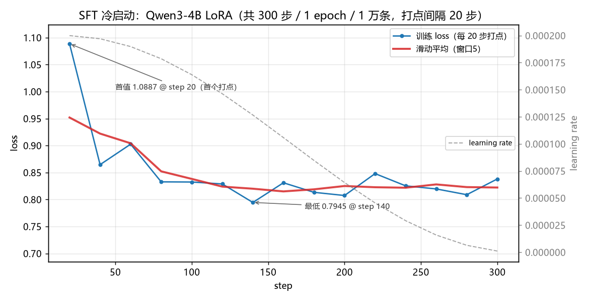
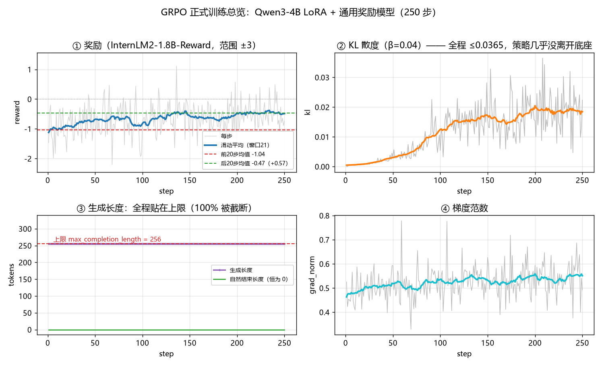
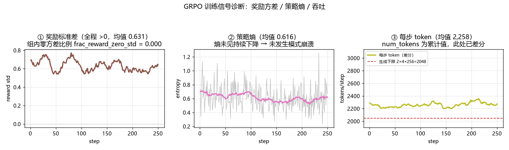
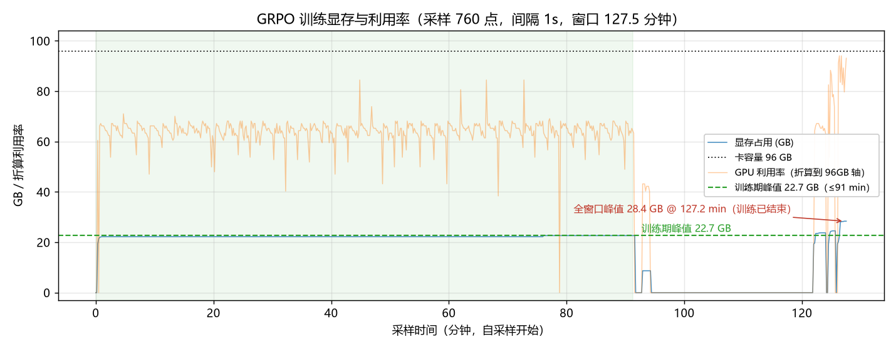

# Qwen3-4B 训练日志

<!-- meta -->
> **实验日期**：2026-09-03（SFT）/ 09-05（GRPO）　｜　**文档日期**：2026-09-12
>
> <sub>日期依据：产物时间戳 09-03（trainer jsonl）与 09-05（GRPO 正式跑 + 边界扫描）。实验日期指实验实际执行时间；文档日期指本文档成稿/更新时间。</sub>

> 本文档由 `_tools/make_4b_training_log.py` 从原始日志自动生成，图表与数字均可复现。
> 数据源：`results/qwen_sft/trainer_e1_qwen3-4b_lora.jsonl`、`results/qwen_grpo/grpo_formal.log`、
> `results/qwen_grpo/grpo_formal_vram.csv`。
> 评测结果与归因分析见 [`bench/RESULTS.md`](https://github.com/Mr-luo-q/minimind/blob/master/experiments/results/bench/RESULTS.md) 与 [`bench/WHY_BASE_WINS.md`](https://github.com/Mr-luo-q/minimind/blob/master/experiments/results/bench/WHY_BASE_WINS.md)。

## 0. 一览

| | SFT 冷启动 | GRPO 正式训练 |
|---|---|---|
| 底座 | Qwen3-4B（真 base） | Qwen3-4B（真 base，**跳过 SFT**） |
| 方法 | LoRA rank16 / alpha32 / 全 7 个投影层 | LoRA rank32 + GRPO |
| 数据 | MiniMind `sft_t2t_mini` 抽 1 万条 | `prompts_2k.jsonl`（2 万 prompts） |
| 训练信号 | 模仿对话 | InternLM2-1.8B-Reward 通用偏好分 |
| 超参 | lr **2e-4**，1 epoch，cutoff 1024 | lr 1e-5，β=0.04，num_gen 4 |
| 步数 / 时长 | 313 步（打点 15 次）/ 20 分 58 秒 | 250 步（每步打点）/ **91.3 分钟** |
| 硬件 | AutoDL RTX 5090 32GB | **RTX PRO 6000 Blackwell 96GB** |
| loss / reward | 1.0887 → 0.8381（最低 0.7945） | -1.466 → -0.738（前20均值 -1.04 → 后20均值 -0.47） |

## 1. SFT 冷启动



- loss **1.0887 → 0.8381**（首末打点，`logging_steps=20`），最低 **0.7945**（step 140）；
- 前 60 步下降最陡（1.089 → 0.902），此后 lr 余弦衰减、loss 在 0.80–0.85 之间震荡不再下探；
- **1 万条数据上 loss 压到 0.7945 属过拟合式拟合**，是后续"用预训练能力换文风"的直接原因
  （见 `bench/WHY_BASE_WINS.md` 第 2 节）。

## 2. GRPO 正式训练



**① 奖励**：前 20 步均值 **-1.04** → 后 20 步均值 **-0.47**（+0.57）。
注意这是**通用偏好分**在涨（回答更像样），**不等于任务能力在涨**——同一 checkpoint 在
GSM8K 上 95.0%（base 94.0%）、IFEval 96.2%（base 98.1%），基本原地不动。

**② KL**：全程 **≤ 0.0365**（均值 0.0117）。策略几乎没有离开底座，
这既解释了"为什么没训坏"，也解释了"为什么没有提升"。

**③ 生成长度**：**每一步都贴在 256 token 上限**，`clipped_ratio` 全程 = **1.00**，
`mean_terminated_length` = 0 —— **没有任何一条 rollout 自然结束**，训练信号建立在被截断的文本上。

**④ 梯度范数**：均值 0.524，无异常尖峰。



## 3. 显存与吞吐



| 指标 | 值 |
|---|---|
| GPU | NVIDIA RTX PRO 6000 Blackwell Server Edition（96 GB） |
| **训练期显存峰值** | **22.7 GB**（与《边界扫描结果.md》记录的 22.7 GB 同口径） |
| 全采样窗口峰值 | 28.4 GB（出现在训练结束之后，属跑批收尾开销） |
| 显存均值（采样） | 17.0 GB |
| GPU 利用率均值 | 51% |
| 采样窗口 | 127.5 分钟（760 点，间隔 1s） |
| 单步耗时 | 均值 21.86s（min 21.54s / max 23.02s） |
| **训练总时长** | **5475 秒 = 91.3 分钟** |

> ⚠️ **两个峰值数字口径不同，别混用**：
> 采样窗口（127.5 分钟）比训练本身（91.3 分钟）**多出 36.3 分钟**，
> 包含模型加载与跑批前后开销 —— 图中绿色阴影是真实训练期，可以看到 28.4 GB 那个尖峰落在阴影之外。
> **汇报时用训练期峰值 22.7 GB（≈报告记录的 22.7 GB）。**

## 4. 逐步指标（每 25 步采样）

| step | reward | reward_std | KL | 熵 | 生成长度 | 截断比 | step_time |
|---|---|---|---|---|---|---|---|
| 25 | -1.080 | 0.579 | 0.0007 | 0.431 | 256 | 1.00 | 22.2s |
| 50 | -0.868 | 0.568 | 0.0031 | 0.592 | 256 | 1.00 | 21.8s |
| 75 | -0.559 | 0.886 | 0.0058 | 0.840 | 256 | 1.00 | 21.8s |
| 100 | -0.862 | 0.331 | 0.0054 | 0.526 | 256 | 1.00 | 21.8s |
| 125 | -0.770 | 0.565 | 0.0141 | 0.558 | 256 | 1.00 | 22.0s |
| 150 | -0.902 | 0.726 | 0.0157 | 0.597 | 256 | 1.00 | 21.7s |
| 175 | -0.868 | 0.342 | 0.0262 | 0.436 | 256 | 1.00 | 21.6s |
| 200 | -0.404 | 0.517 | 0.0155 | 0.413 | 256 | 1.00 | 22.3s |
| 225 | -0.588 | 0.429 | 0.0149 | 0.447 | 256 | 1.00 | 21.8s |
| 250 | -0.738 | 0.538 | 0.0224 | 0.672 | 256 | 1.00 | 21.9s |

## 5. 硬件与配置摘要

```
GPU      : NVIDIA RTX PRO 6000 Blackwell Server Edition (96 GB)
SFT      : Qwen3-4B + LoRA r16/a32, lr 2e-4, 1 epoch, 1万条, cutoff 1024,
           313 步（日志末打点 300）, 20分58秒, 显存峰值约 24 GB (RTX 5090 32GB)
GRPO     : Qwen3-4B + LoRA r32, lr 1e-5, beta 0.04, num_generations 4,
           max_completion_length 256, batch 2 x grad_accum 4,
           250 步, 91.3 分钟, 峰值 22.7 GB, 步时约 22 s
奖励模型 : InternLM2-1.8B-Reward (fp16)
```

## 6. 从这批日志读出的三个问题

1. **奖励与目标无关**：奖励分在涨，但 GSM8K/IFEval 不动 —— 通用偏好分不等于任务能力；
2. **KL 太小（≤0.0365）**：250 步几乎没有位移，底座能力保住了，但也没学到东西；
3. **rollout 100% 截断**：`clipped_ratio` 恒为 1、终止长度恒为 0，所有候选都被截成半句话，
   会压缩组内奖励方差（实测均值 0.631），削弱 GRPO 的优势信号。

> 这三点已写入第二阶段方案 [`EXPERIMENT_PLAN_V2.md`](https://github.com/Mr-luo-q/minimind/blob/master/experiments/EXPERIMENT_PLAN_V2.md)：
> 改用**规则奖励（RLVR）**、**加大策略位移**、并把 `clipped_ratio` 与
> `frac_reward_zero_std` 列为阶段 0 的前置检查项。
