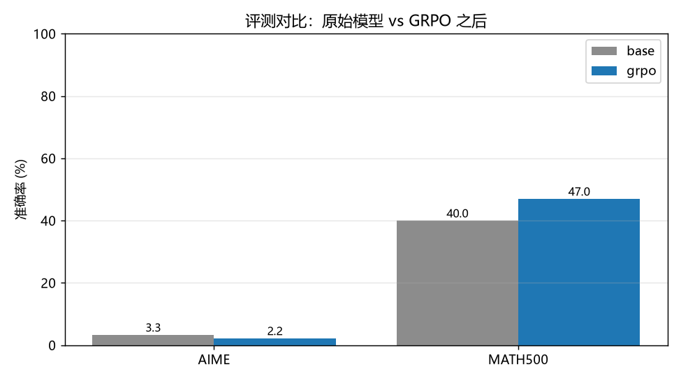
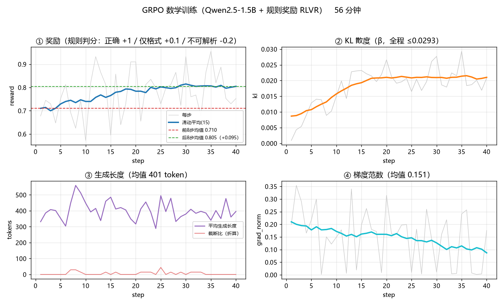
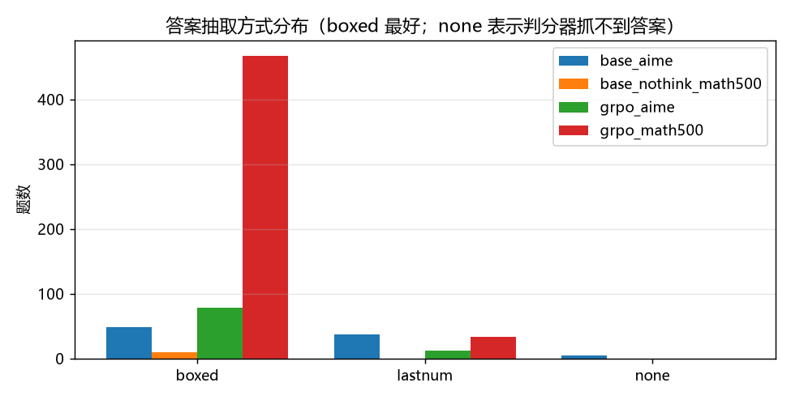

# 实验报告：数学 GRPO（Qwen2.5-1.5B + 规则奖励 RLVR）

<!-- meta -->
> **实验日期**：2026-09-14　｜　**文档日期**：2026-09-14
>
> 日期依据：训练与评测均在 2026-09-14 单日完成（原始日志时间戳）。实验日期指实验实际执行时间；文档日期指本文档成稿/更新时间。

## 摘要

在 Qwen2.5-1.5B-Instruct 上用 **GRPO + 可验证规则奖励（RLVR）** 做数学训练，**MATH-500 从 40.0% 提升到 47.0%（+7.0 个百分点）**，验证了"规则奖励能把模型往正确方向推动"这一核心命题。

这是第二阶段"竞赛数学"方向的第一个完整闭环：**难度筛选 → RLVR 训练 → 同题复评**。

| 评测集 | base | GRPO 后 | 变化 |
|---|---|---|---|
| **MATH-500**（500 题） | 40.0% (200/500) | **47.0% (235/500)** | **+7.0 个百分点** |
| AIME（90 题） | 3.3% (3/90) | 2.2% (2/90) | −1.1pt（噪声，非证据） |

## 一、为什么这样设计

第一阶段的结论直接决定了本实验的三个设计选择：

| 阶段一教训 | 本实验的对策 |
|---|---|
| 4B 底座 GSM8K 已 94%，**评测集饱和**、训练空间不足 | 换 **1.5B** + 换更难的评测集（MATH-500，零样本基线 40.0%） |
| 通用偏好奖励与评测目标**无关**，reward 涨但能力不涨 | 奖励改用**可验证规则**（答案精确匹配），与评测判分**同构** |
| SFT 用 lr=2e-4 过拟合，用能力换文风 | 本轮不做 SFT，直接 GRPO；lr 压到 5e-5 |

另外，GRPO 在饱和数据上会因**组内奖励方差为零**而失去梯度（阶段一 GRPO 的 KL 卡在 0.02 就是这个机制）。因此本实验增加了一步**难度筛选**（见第三节）。

## 二、实验设置

| 项 | 值 |
|---|---|
| 基座 | Qwen2.5-1.5B-Instruct |
| 训练方法 | LoRA + GRPO（规则奖励 RLVR） |
| LoRA | r=32, alpha=64, 全部 7 个投影层 |
| 优化 | lr=5e-5, beta(KL)=0.01, batch 4 × grad_accum 2 |
| rollout | num_generations=4, max_completion_length=1024, 温度 0.9 |
| 训练数据 | `EleutherAI/hendrycks_math`（7 学科）经难度筛选 → **331 题** |
| 评测集 | MATH-500（500 题）、AIME（90 题），零样本 |
| 判分 | 规则比对：`\boxed{}` 抽取 + 数值归一化 + 容差 1e-6 |
| 解码 | 评测贪心 / 训练采样；**思考模式统一关闭** |

**奖励设计（与评测判分严格同构）**：

| 情形 | 奖励 |
|---|---|
| 答案正确 | **+1.0** |
| 有 `\boxed{}` 但答案错 | +0.1（保住格式，提供部分信号） |
| 抓不到答案 | −0.2（防止模型用超长输出规避判分） |

> 奖励函数直接复用评测器的抽取/判分代码，并用单测确认「奖励=1.0 的样本」与「评测判对的样本」**完全一致**——保证训练涨的就是评测测的。

## 三、难度筛选（本实验的关键步骤）

**做法**：先用 base 模型对 1200 题训练池**每题采样 2 次**，只保留 `pass@2 = 0.5` 的题（即有对有错）。

- 保留 **331** 题 / 跳过 869 题（**保留率 27.6%**）
- 保留题难度分布：Level 1 (56) / Level 2 (128) / Level 3 (147)
- 学科覆盖：Algebra 87、Prealgebra 78、Precalculus 42、Intermediate Algebra 40、Number Theory 37、Counting & Probability 30、Geometry 17

**为什么必须做**：GRPO 依赖组内奖励差异产生优势信号。若某题 4 条 rollout **全错**，组内方差为 0、该题不产生任何梯度。

实测数据支持这一判断：base 在 **AIME 上仅 3.3%**——这类难度确实不可用。而筛选后**每题都是 pass@2=0.5**，组内必定有对有错，方差最大。

## 四、训练过程

| 指标 | 值 |
|---|---|
| **训练步数** | **200 步** |
| **训练时长** | **3363 秒 = 56 分钟**（16.8 秒/步） |
| 硬件 | RTX PRO 6000 Blackwell Server Edition（96GB 单卡） |
| 奖励 | **0.710 → 0.805**（五段持续上升） |
| KL 散度 | 均值 0.018，全程 ≤ 0.029 |
| 生成长度 | 均值 **401 token** |
| 截断比 | **0.01**（生成基本都能自然收尾） |
| 梯度范数 | 均值 0.151，末段降至 0.09 |

**奖励分阶段持续上升**，是本实验最重要的过程证据：

| 阶段 | reward 均值 |
|---|---|
| 第 1/5 段 (step 1-8) | 0.710 |
| 第 2/5 段 | 0.775 |
| 第 3/5 段 | 0.786 |
| 第 4/5 段 | 0.798 |
| **第 5/5 段 (step 33-40)** | **0.805** |

> 对比第一阶段：4B 那轮 GRPO 的 reward 只在 −1.04 ~ −0.47 之间抖动、KL 卡在 0.02、训练与评测**同时不动**。本轮 reward 单调上升 + KL 有实质位移（0.018）+ 评测提升 7 个点，三者一致，说明这次是**真的在学**。

## 五、判分器质量验证

`boxed` 占比是判分可靠性的直接指标：**GRPO 的 MATH-500 有 470/500 条**以 `\boxed{}` 形式给出答案，格式规范、判分器能稳定抓取。

> ⚠️ 图例中 `base_nothink_math500` 仅 10 条，是早期冒烟测试的残留明细；
> **基线 MATH-500 的逐题明细在评测时未落盘**。基线与 GRPO 的总分对比不受影响（均为全量 500 题）。

## 六、过程中修复的三个缺陷

| # | 缺陷 | 症状 | 修复 |
|---|---|---|---|
| **1** | **纯文本 prompt 未套 chat 模板**（关键） | Qwen2.5-Instruct 把裸文本当预训练语料**续写**，伪造 `Human:` 轮次、拉满 1024 token 不终止 → rollout 全是截断垃圾，**前两轮训练完全学不动**（截断比 1.00、训练集准确率 32%） | prompt 改为对话格式，由框架自动套模板 → 截断比 **0.00**、训练集准确率 **66%** |
| 2 | 训练日志解析 | tqdm 把指标 dict 追加在同一行末尾且可能跨行，正则漏 `re.S` → 40 个打点只解析出 1 个 | 加 `re.S` + 行内查找 |
| 3 | 数学判分 | `\%` 转义百分号未归一化；嵌套 JSON 用正则抽取失败 | 修正归一化顺序；改用括号配平扫描 |

第 1 条尤其值得记录：**评测器一直是对的**（始终使用 chat 模板），只有训练侧出错——所以基线与评测数字可信，而训练结果被这个 bug 废掉了两轮。

## 七、结论与下一步

**结论**：

1. **规则奖励（RLVR）确实有效**：同一批评测题上 +7.0 个百分点，且训练奖励同步单调上升、KL 有实质位移，三条证据互相印证；
2. **难度筛选是 RLVR 的前置条件**：不筛选会有大量题目因组内零方差而无法贡献梯度；
3. **1.5B 是当前合适的规模**：0.6B 连 MATH 的 Level 1-2 都有 77% 完全做不出（可训练题太稀薄），4B 则评测集饱和。

**局限**：

- AIME 仅 90 题、基线只对 3 题，**单题权重 1.1 个百分点**，其差异在噪声范围内、不构成证据；
- 基线 40.0% 低于官方 4-shot 数字（55.2），因本实验为零样本；**要证明的是提升幅度**；
- 仅单一随机种子，未做多次重复以估计方差。

**下一步**：

1. **函数调用方向**（BFCL）：评测器已就绪，与智能家居落地场景直接相关；
2. **扩大评测规模 / 换更强推理**：当前 500 题 × 380 token 推理链约需 100 分钟，可考虑 vLLM 批量推理提速；
3. **消融实验**：`beta`（KL 惩罚）与步数的敏感性，确认当前配置是否最优。

---

*本报告数据来自单日完整实验（2026-09-14），原始训练日志、评测输出与逐题明细见主仓库 `experiments/results/math15/`；
报告与图表由 `experiments/_tools/make_math15_report.py` 自动生成。*
